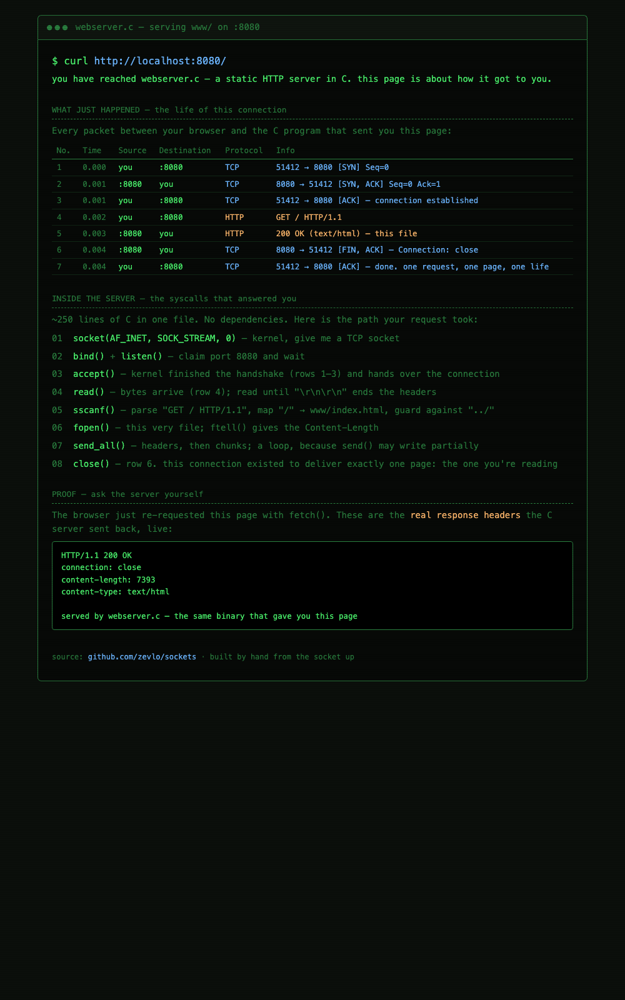

# sockets

Learning networking in C from the syscall up: three small servers, each one
layer above the last.

## Projects

| Project | What it is | Concepts |
|---|---|---|
| `basic/` | Daytime server + client — server sends the current time to whoever connects | the socket lifecycle: `socket`, `bind`, `listen`, `accept`, `connect`, `read`/`write`, `close` |
| `chat/` | Multi-client terminal chat room | `select()` I/O multiplexing, client tracking, broadcast, `pthread` on the client for concurrent send/receive |
| `webserver/` | Static HTTP server serving files from `www/` | HTTP as a text protocol over TCP, request parsing, content types, error responses |

## Build

Requires a C compiler and make (Linux or macOS):

```bash
make
```

Binaries land next to their sources. Clean up with `make clean`.

## Run

### Daytime

```bash
# terminal 1
./basic/server
# terminal 2
./basic/client 127.0.0.1
```

### Chat

```bash
# terminal 1
./chat/chat_server
# terminals 2 and 3 (IP defaults to 127.0.0.1)
./chat/chat_client
```

Once connected, set a name with `/nick alice`, then type to broadcast.

### Web server

```bash
cd webserver && ./webserver
```

Then open `http://localhost:8080/` — the index page is self-referential: it
shows the TCP handshake, HTTP exchange, and the code path inside this server
that delivered it, with its own response headers fetched back live.



## Implementation notes

Details worth knowing if you read the code:

**Error handling and robustness (all projects)**
- Return-value checks on every socket call (`socket`, `bind`, `listen`, `accept`, `connect`)
- `send_all()` loop to handle partial sends, used by chat and web server
- `EINTR` handling in the chat server's `select()` loop
- Safe null-termination of receive buffers
- Server-full rejection instead of silent overwrite when chat hits `MAX_CLIENTS`

**Web server**
- Parses the HTTP request line — serves any file under `www/`, not just a hardcoded `index.html`
- Content types for html, css, js, svg, png, jpg, txt; `Content-Length` computed from the file
- Proper error responses: `404 Not Found`, `403 Forbidden`, `501 Not Implemented`
- Path traversal guard — requests containing `..` are rejected with `403`
- Request logging to stdout

**Chat**
- `/nick <name>` command; server tracks nicknames, announces changes, prefixes broadcasts
- Join announcements to the room
- Client takes the server IP as an argument (was hardcoded to `127.0.0.1`)

**Self-referential index page**
- `www/index.html` is a terminal-styled walkthrough of the connection that
  loaded it — capture table, syscall path through `webserver.c`, and a live
  `fetch()` that displays the server's actual response headers
